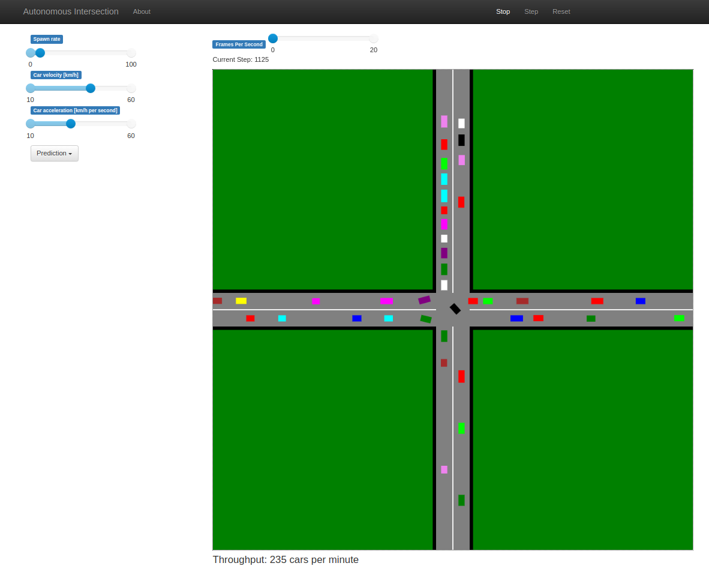

# Autonomous Intersection

Simulation of simple autonomous intersection management system in
[Mesa](https://mesa.readthedocs.io/en/latest/).

It simulates a four-lane intersection traffic with self-driving cars.
Supported modes are:
- Traffic lights (validation model, simulates standard human-driven cars)
- Basic reservation (each vehicle reserves given quarters of intersection space)
- Advanced reservation (same as basic reservation but with dynamic revoking of reservations)
- Prediction (Intersection manager allows a vehicle to pass as soon as prediction shows that it will definitely not crash with other vehicles)

Additionally, several parameters are exposed like car spawn rate, cars' maximum velocity and acceleration.

